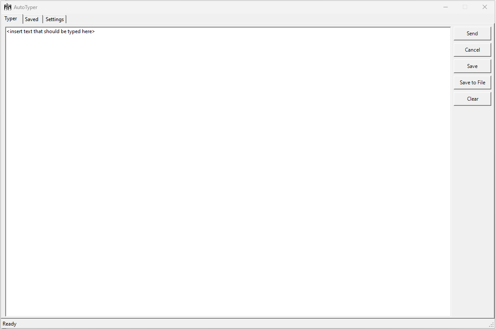

# AutoTyper
This WinForm program, created in PowerShell, allows users to send keystrokes to the active window.

##  :beginner: About
This WinForm program provides a simple and effective way to send keystrokes to the active window, offering a practical solution for various scenarios. Whether you need to copy-paste text through a HP iLO session or a locked down RDP session. This tool simply types the keys strokes instead of you manually typing it.

## :zap: Features
- Sends keystrokes to the active window
- Simple and easy-to-use WinForm interface
- Configure delays before sending keystrokes and delay between each key stroke
- Save each input, so it can be used later
- Export and Import inputs to use on another machine

###  :electric_plug: Installation

Before installing the module, the following prerequisites must be fulfilled:

- [ ] At least **PowerShell 5.1** installed.
- [ ] To download the tool, you need an internet connection.
- [ ] Only works on Windows-platform

###  :package: Commands
1. To install the module run the following in a PowerShell session:

   ```powershell
   Install-Module -Name SystemAdmins.AutoTyper -Scope CurrentUser -Force
   ```

2. Import the module in the PowerShell session:

   ```powershell
   Import-Module -Name SystemAdmins.AutoTyper
   ```

3. Now run the tool by:

   ```powershell
   Invoke-AutoTyper
   ```


## :camera: ​Screenshot


